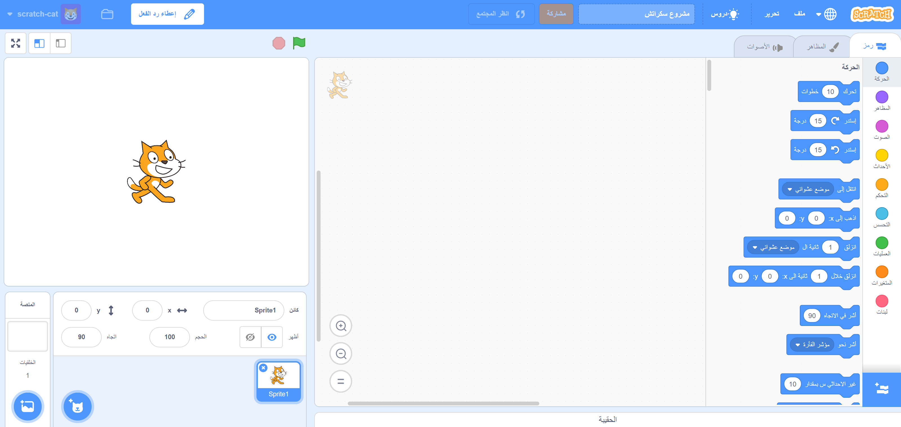
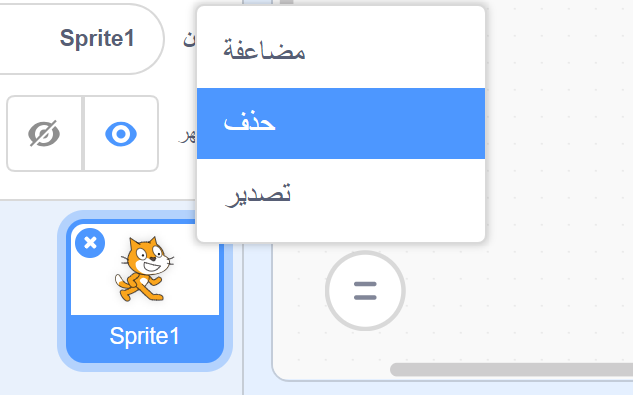

يمكنك استخدام Scratch عبر الإنترنت أو بدون اتصال.

+ **عبر الإنترنت** - لإنشاء مشروع Scratch جديد باستخدام المحرر عبر الإنترنت، اذهب إلى <a href="http://rpf.io/scratch-new" target="_blank">rpf.io/scratch-new</a>

+ **دون إتصال إنترنت** - إذا كنت تفضل العمل دون اتصال ولم تقم بتثبيت المحرر بعد، يمكنك تحميله من <a href="http://rpf.io/scratch-off" target="_blank">rpf.io/scratch-off</a>

يظهر محرر Scratch على النحو التالي:

+ The cat sprite that you can see is the Scratch mascot. If you need an empty Scratch project, you can delete the cat by right-clicking it and then clicking **delete**.

