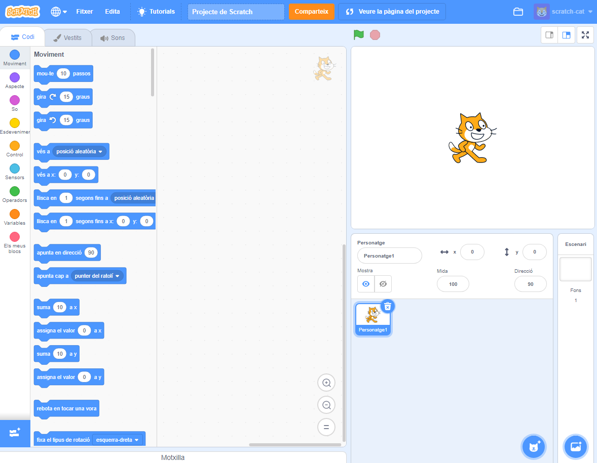
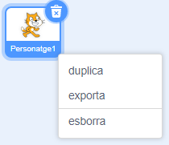

Pots utilitzar Scratch en línia o fora de línia.

+ **Online** - to create a new Scratch project using the online editor, go to <a href="https://rpf.io/scratch-new" target="_blank">rpf.io/scratch-new</a>

+ **Offline** - if you prefer to work offline and have not installed the editor yet, you can download it from <a href="https://rpf.io/scratch-off" target="_blank">rpf.io/scratch-off</a>

L'editor Scratch té aquest aspecte:

+ El dibuix del gat que pots veure és la mascota de Scratch. Si necessites un projecte de Scratch sense res, pots eliminar el gat prement el botó dret del ratolí sobre ell i fent clic a **esborra**.

