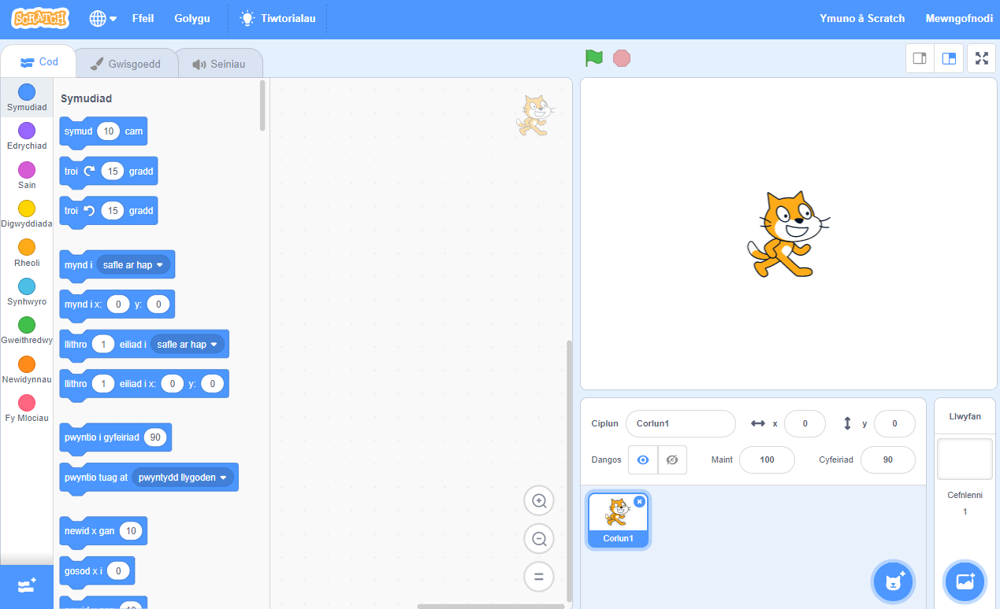
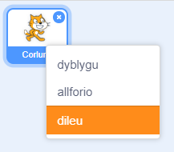

Gallwch chi ddefnyddio Scratch ar-lein neu all-lein.

+ **Arlein** - i greu prosiect Scratch newydd yn defnyddio'r golygydd arlein, ewch i <a href="https://rpf.io/scratch-new" target="_blank">rpf.io/scratch-new</a>

+ **All-lein** - os oes well gyda chi weithio all-lein a heb osod y golygydd eto, mae modd ei lawrlwytho o <a href="https://rpf.io/scratch-off" target="_blank">rpf.io/scratch-off</a>

Mae golygydd Scratch yn edrych fel hyn:

+ Mae'r corlun cath rwyt ti'n ei weld yn Scratch yn fasgot. Os wyt ti angen prosiect Scratch gwag, mae modd gwneud clic-dde ar y gath ac yna clicio **dileu**.

