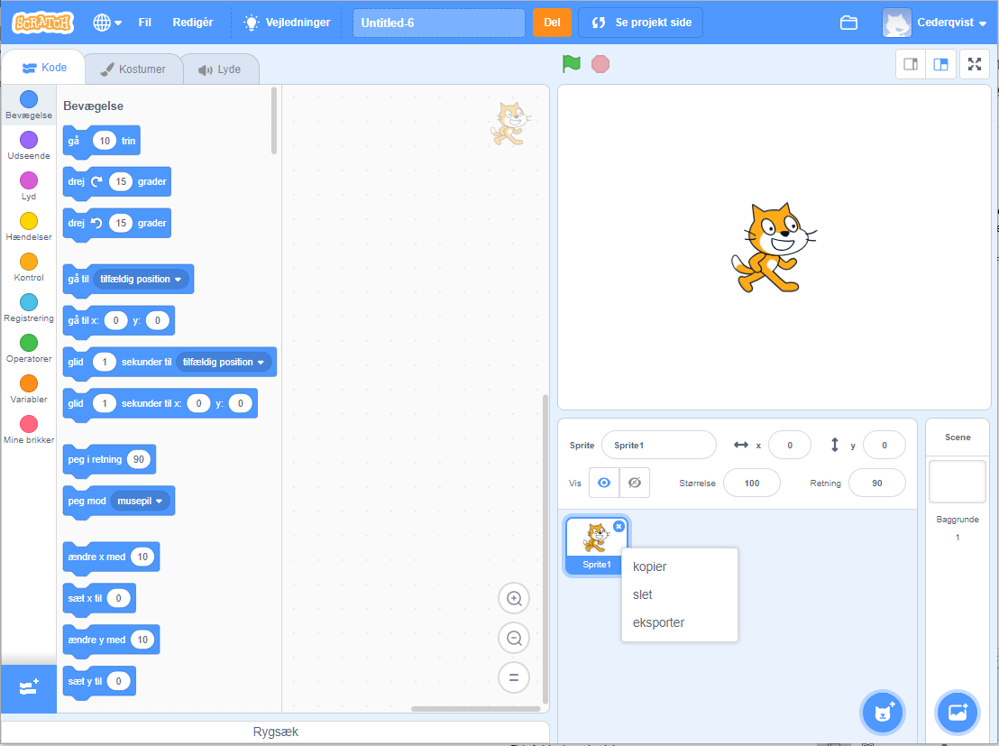
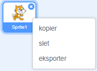

Du kan bruge Scratch både online eller offline.

+ ** Online ** - for at oprette et nyt Scratch-projekt ved hjælp af online-editoren, skal du gå til <a href="http://rpf.io/scratch-new" target="_blank"> rpf.io/scratch-new </a>

+ ** Offline ** - Hvis du foretrækker at arbejde offline og ikke har installeret editoren endnu, kan du downloade den fra <a href="http://rpf.io/scratch-off" target="_blank"> rpf.io/scratch-off </a>

Scratch-editoren ser sådan ud:

+ Kat spriten, som du kan se, er Scratchs maskotten. Hvis du har brug for et tomt Scratch-projekt, kan du slette katten ved at højreklikke på den og derefter klikke på **Slet**.

