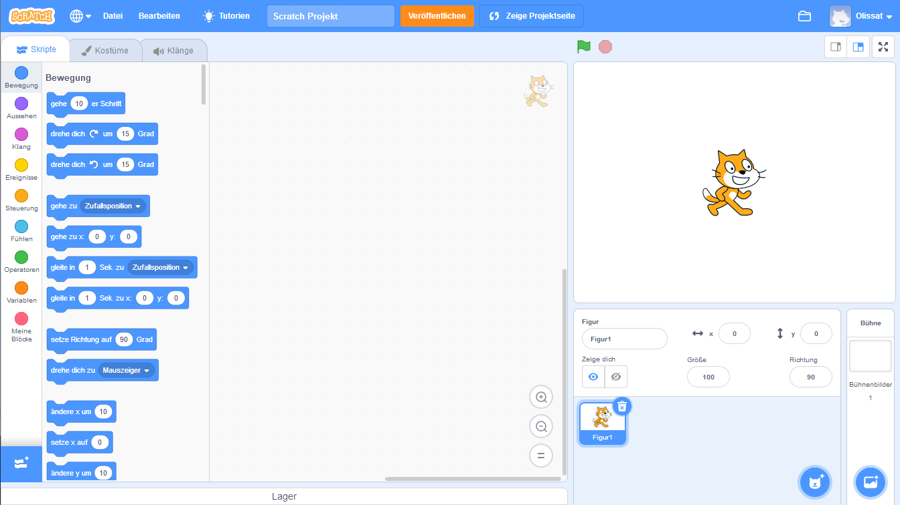
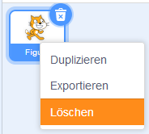

Du kannst Scratch online oder offline verwenden.

+ **Online** - Um ein neues Scratch-Projekt mit dem Online-Editor zu erstellen, gehe zu <a href="http://rpf.io/scratch-new" target="_blank">rpf.io/scratch-new</a>

+ **Offline** - Wenn du lieber offline arbeitest und den Editor noch nicht installiert hast, kannst du ihn von <a href="http://rpf.io/scratch-off" target="_blank">rpf.io/scratch-off</a> herunterladen

Der Scratch-Editor sieht folgendermaßen aus:

+ Die Katzen-Figur die du sehen kannst ist das Scratch-Maskottchen. Wenn du ein leeres Scratch-Projekt brauchst, kannst du die Katze löschen, indem du mit der rechten Maustaste auf sie klickst und dann auf **Löschen** klickst.

