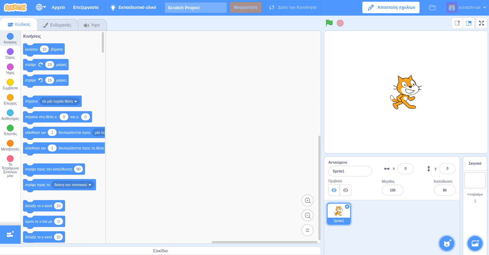
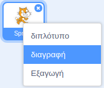

Μπορείς να χρησιμοποιήσεις το Scratch σε σύνδεση (online) ή εκτός σύνδεσης (offline).

+ **Online** - για να δημιουργήσεις ένα νέο έργο Scratch χρησιμοποιώντας τον online επεξεργαστή, πήγαινε στο <a href="https://rpf.io/scratch-new" target="_blank">rpf.io/scratch-new</a>

+ **Offline** - αν προτιμάς να εργάζεσαι εκτός σύνδεσης και δεν έχεις εγκαταστήσει ακόμα τον επεξεργαστή, μπορείς να το κατεβάσεις από το <a href="https://rpf.io/scratch-off" target="_blank">rpf.io/scratch-off</a>

Ο επεξεργαστής Scratch μοιάζει έτσι:

+ Η γάτα που βλέπεις είναι η μασκότ του Scratch. Εάν χρειάζεσαι ένα κενό έργο Scratch, μπορείς να διαγράψεις τη γάτα κάνοντας δεξί κλικ πάνω της και ξανά κλικ στο **διαγραφή**.

