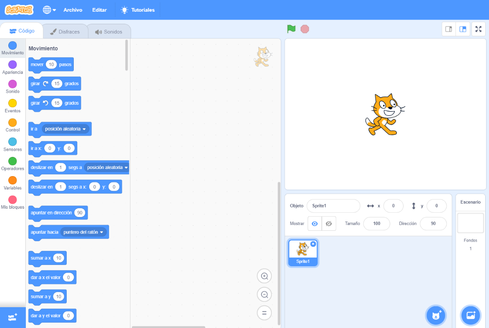
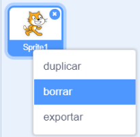

Puedes usar Scratch en línea o fuera de línea.

+ **En línea** - para crear un nuevo proyecto en Scratch usando el editor en línea, dirígete a <a href="http://rpf.io/scratch-new" target="_blank">rpf.io/scratch-new</a>

+ **Sin conexión** - si prefieres trabajar sin conexión y aún no has instalado el editor, puedes descargarlo desde <a href="http://rpf.io/scratch-off" target="_blank">rpf.io/scratch-off</a>

El editor de Scratch se ve así:

+ El objeto gato que puedes ver es la mascota Scratch. Si necesitas un proyecto de Scratch vacío, puedes eliminar el gato haciendo clic derecho y luego haciendo clic en **borrar**.

