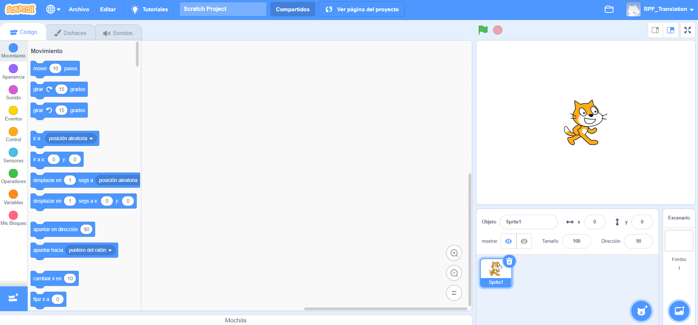
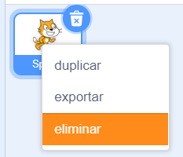

Puedes usar Scratch en línea o sin conexión.

+ **Online** - to create a new Scratch project using the online editor, go to <a href="https://rpf.io/scratch-new" target="_blank">rpf.io/scratch-new</a>

+ **Offline** - if you prefer to work offline and have not installed the editor yet, you can download it from <a href="https://rpf.io/scratch-off" target="_blank">rpf.io/scratch-off</a>

El editor de Scratch se ve así:

+ El objeto de gato que puedes ver, es la mascota de Scratch. Si necesitas un proyecto Scratch vacío, puedes eliminar el gato haciendo clic con el botón derecho y luego presionar ** eliminar **.

