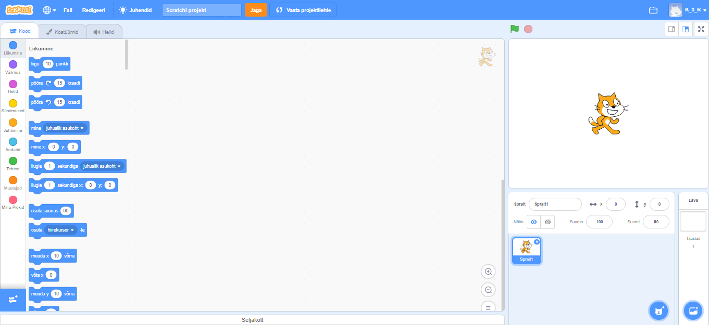
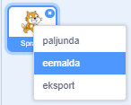

Saad Scratchi kasutada, olles võrku ühendatud ja ka väljaspool seda.

+ **Võrgus olles** - uue Scratchi projekti loomiseks veebiredaktori abil mine <a href="http://rpf.io/scratch-new" target="_blank">rpf.io/scratch-new</a>

+ **Võrgust väljas** - kui soovid töötada võrguühenduseta ja pole veel redaktorit installinud, saad selle alla laadida <a href="http://rpf.io/scratch-off" target="_blank">rpf.io/scratch-off</a>

Scratchi redaktor näeb välja selline:

+ Kassi sprait, mida näete, on Scratchi maskott. If you need an empty Scratch project, you can delete the cat by right-clicking it and then clicking **delete**.

