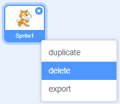

شما می توانید از اسکرچ به صورت آنلاین یا آفلاین استفاده کنید.

+ **Online** - to create a new Scratch project using the online editor, go to <a href="http://rpf.io/scratch-new" target="_blank">rpf.io/scratch-new</a>

+ **Offline** - if you prefer to work offline and have not installed the editor yet, you can download it from <a href="http://rpf.io/scratch-off" target="_blank">rpf.io/scratch-off</a>

ویرایشگر اسکرچ مانند این است:

+ The cat sprite that you can see is the Scratch mascot. If you need an empty Scratch project, you can delete the cat by right-clicking it and then clicking **delete**.

