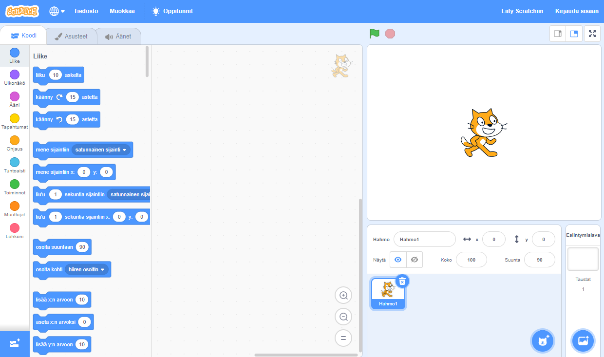
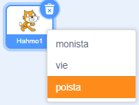

Voit käyttää Scratchia online-tilassa tai offline-tilassa.

+ **Online** - luodaksesi uuden Scratch-projektin online-editorilla, siirry osoitteeseen <a href="http://rpf.io/scratch-new" target="_blank">rpf.io/scratch-new</a>

+ **Offline** - jos haluat työskennellä offline-tilassa ja et ole vielä asentanut editoria, voit ladata sen osoitteesta <a href="http://rpf.io/scratch-off" target="_blank">rpf.io/scratch-off</a>

Scratch-editori näyttää tältä:

+ Kissahahmo, jonka voit nähdä, on Scratch-maskotti. If you need an empty Scratch project, you can delete the cat by right-clicking it and then clicking **delete**.

