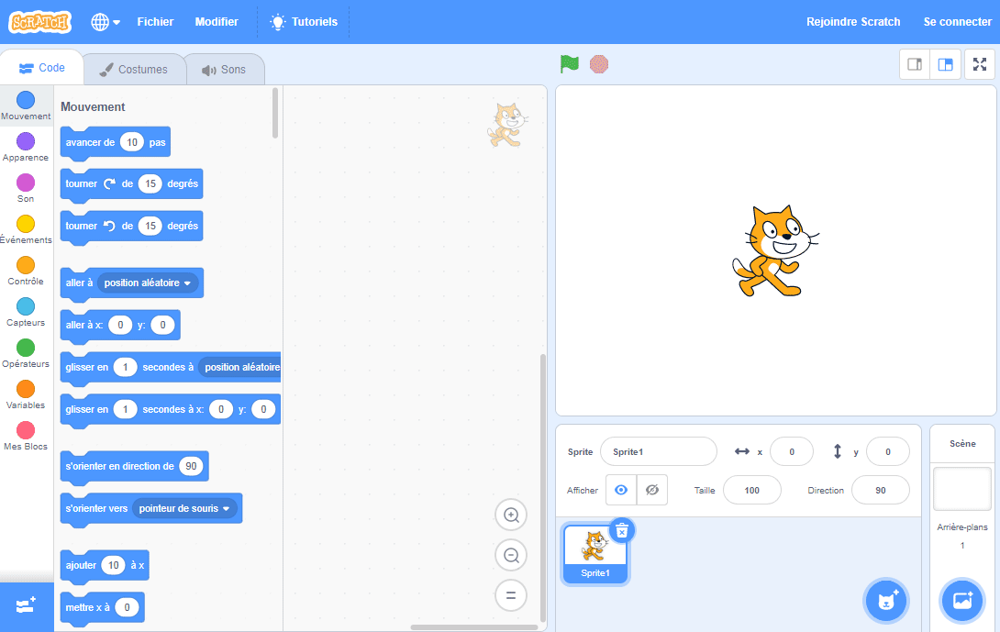
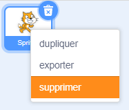

Tu peux utiliser Scratch en ligne ou hors ligne.

+ **Online** - to create a new Scratch project using the online editor, go to <a href="https://rpf.io/scratch-new" target="_blank">rpf.io/scratch-new</a>

+ **Offline** - if you prefer to work offline and have not installed the editor yet, you can download it from <a href="https://rpf.io/scratch-off" target="_blank">rpf.io/scratch-off</a>

L'éditeur Scratch ressemble à ceci:

+ Le lutin que tu vois est la mascotte Scratch. Si tu a besoin d'un projet Scratch vide, tu peux supprimer le chat en cliquant avec le bouton droit, puis en cliquant sur **Supprimer**.

