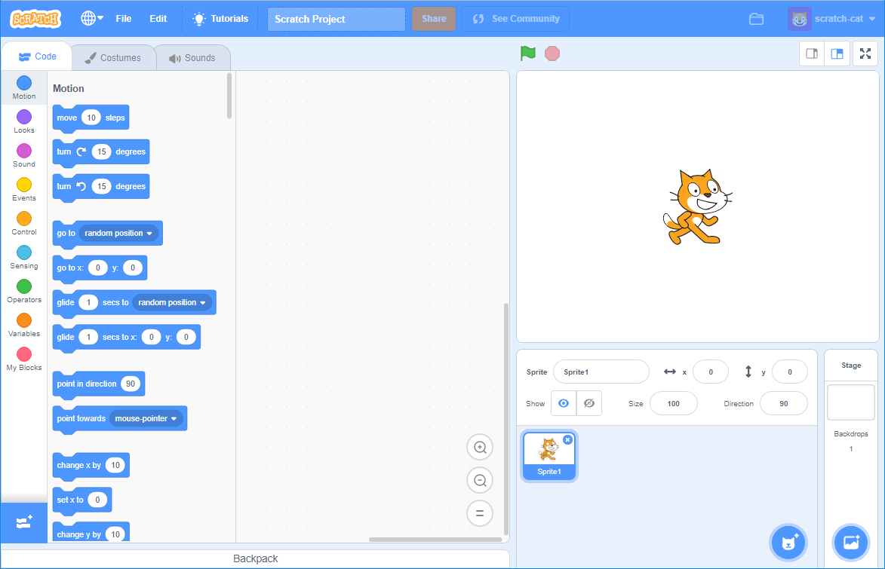

आप स्क्रैच को ऑनलाइन या ऑफ़लाइन उपयोग कर सकते हैं।

+ **Online** - ऑनलाइन एडिटर से एक नया स्क्रैच प्रोजेक्ट बनाने के लिए, <a href="https://rpf.io/scratch-new" target="_blank"> rpf.io/scratch-new </a> पर जाएं

+ **Offline** - अगर आप ऑफलाइन, यानि की बिना इंटरनेट, काम करना चाहते हैं और आपने अभी तक एडिटर को डाउनलोड नहीं किया है, तोह आप यहाँ से कर सकते हैं: <a href="https://rpf.io/scratch-off" target="_blank">rpf.io/scratch-off</a>

स्क्रैच एडिटर इस तरह दिखती है:

+ यहाँ जो आप बिल्ली स्प्राइट देख रहे हैं वो स्क्रैच की शुभंकर, यानि की मैस्कॉट है। अगर आपको एक खाली स्क्रैच प्रोजेक्ट चाहिए, तो आप राइट क्लिक करें और **delete** बटन दबाएं, जिस से आप उस बिल्ली को निकाल सकते हैं।

