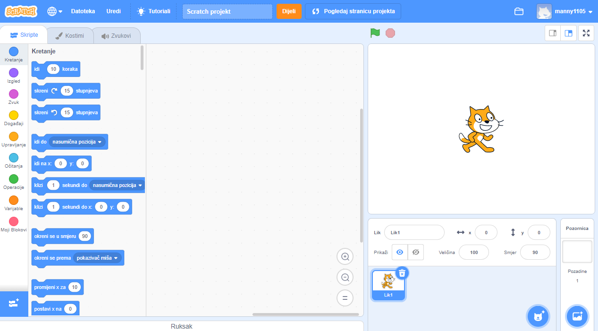
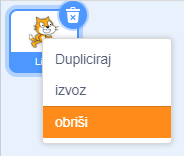

Možeš koristiti Scratch online ili offline.

+ **Online** - za stvaranje novog Scratch projekta pomoću online uređivača, idi na <a href="http://rpf.io/scratch-new" target="_blank">rpf.io/scratch-new</a>

+ **Offline** - ako želiš raditi na projektu bez interneta i još nemaš instaliran uređivač, možeš ga preuzeti sa <a href="http://rpf.io/scratch-off" target="_blank">rpf.io/scratch-off</a>

Scratch uređivač izgleda ovako:

+ Lik mačke koji možeš vidjeti je maskota Scratcha. Ako ti je potreban prazan Scratch projekt, možeš izbrisati mačku tako da klikneš na nju desnom tipkom miša i zatim odabereš **obriši**.

