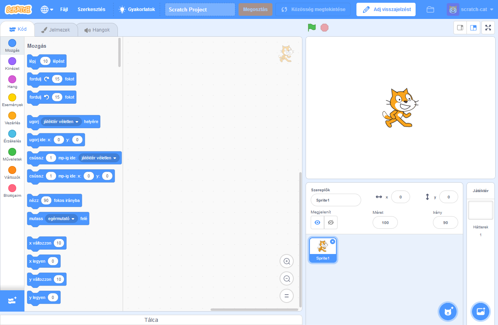
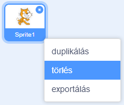

A Scratchet online vagy offline módban is használhatod.

+ **Online** - to create a new Scratch project using the online editor, go to <a href="https://rpf.io/scratch-new" target="_blank">rpf.io/scratch-new</a>

+ **Offline** - if you prefer to work offline and have not installed the editor yet, you can download it from <a href="https://rpf.io/scratch-off" target="_blank">rpf.io/scratch-off</a>

A Scratch szerkesztő így néz ki:

+ A macska, akit láthatsz, a Scratch kabalafigurája. Ha üres Scratch projektet szeretnél, törölheted a macskát úgy, hogy rákattintasz jobb gombbal, majd kiválasztod a **törlés** menüpontot.

