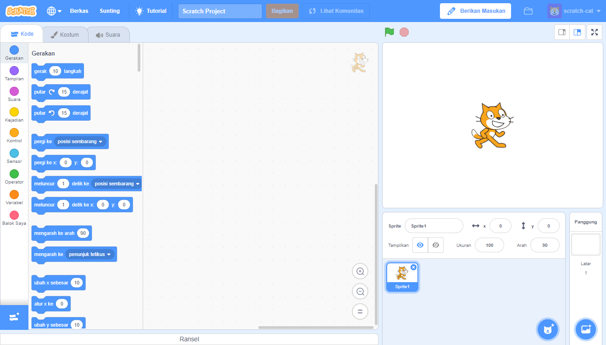

Kamu bisa menggunakan Scratch secara daring atau luring.

+ **Online** - to create a new Scratch project using the online editor, go to <a href="https://rpf.io/scratch-new" target="_blank">rpf.io/scratch-new</a>

+ **Offline** - if you prefer to work offline and have not installed the editor yet, you can download it from <a href="https://rpf.io/scratch-off" target="_blank">rpf.io/scratch-off</a>

Editor Scratch terlihat seperti ini:

+ Sprite kucing yang kamu lihat adalah maskot Scratch. Jika kamu membutuhkan proyek Scratch kosong, kamu dapat menghapus kucing dengan mengklik kanan dan kemudian mengklik **hapus**.

