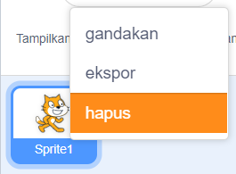

Kamu bisa menggunakan Scratch secara daring atau luring.

+ **Online** - Untuk membuat projek Scratch baru menggunakan editor online, buka <a href="http://rpf.io/scratch-new" target="_blank">rpf.io/scratch-new</a>

+ ** Offline ** - Jika kamu lebih suka bekerja offline dan belum menginstal editor, kamu dapat mengunduhnya dari <a href="http://rpf.io/scratch-off" target="_blank"> rpf.io/scratch-off </a>

Editor Scratch terlihat seperti ini:

+ Sprite kucing yang kamu lihat adalah maskot Scratch. Jika kamu membutuhkan proyek Scratch kosong, kamu dapat menghapus kucing dengan mengklik kanan dan kemudian mengklik **hapus**.

