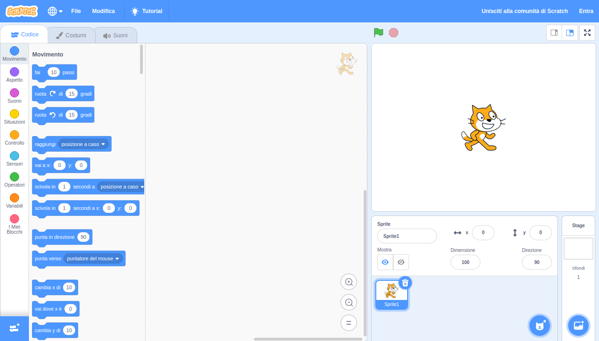
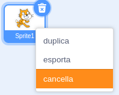

Puoi utilizzare Scratch online oppure offline.

+ **Online** - per creare un nuovo progetto di Scratch usando l'editor online, vai su <a href="http://rpf.io/scratch-new" target="_blank">rpf.io/scratch-new</a>

+ **Offline** - se preferisci lavorare offline e non hai ancora installato l'editor, puoi scaricarlo da <a href="http://rpf.io/scratch-off" target="_blank">rpf.io/scratch-off</a>

L'editor di Scratch ha questo aspetto:

+ Lo sprite del gatto che vedi è la mascotte Scratch. Se hai bisogno di un progetto Scratch vuoto, puoi eliminare il gatto facendo clic con il tasto destro del mouse e quindi facendo clic su ** cancella**.

