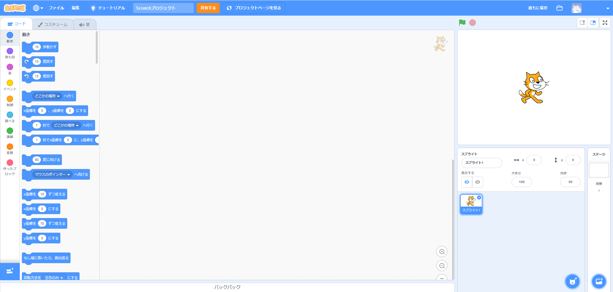
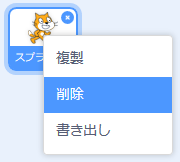

Scratch (スクラッチ) はオンラインまたはオフラインで使用できます。

+ **Online** - to create a new Scratch project using the online editor, go to <a href="https://rpf.io/scratch-new" target="_blank">rpf.io/scratch-new</a>

+ **Offline** - if you prefer to work offline and have not installed the editor yet, you can download it from <a href="https://rpf.io/scratch-off" target="_blank">rpf.io/scratch-off</a>

Scratchのエディタは次のようになります。

+ ネコはScratchのマスコットです。 何もないプロジェクトから始めたい時は、ネコを右クリックしてから**削除**(さくじょ)をクリックすることでネコを消すことができます。

