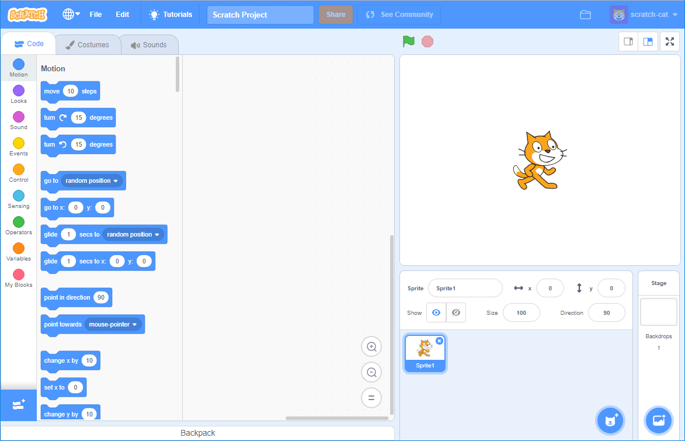

ನೀವು Scratch ಅನ್ನು ಆನ್‌ಲೈನ್ ಅಥವಾ ಆಫ್‌ಲೈನ್‌ನಲ್ಲಿ ಬಳಸಬಹುದು.

+ **Online** - to create a new Scratch project using the online editor, go to <a href="https://rpf.io/scratch-new" target="_blank">rpf.io/scratch-new</a>

+ **Offline** - if you prefer to work offline and have not installed the editor yet, you can download it from <a href="https://rpf.io/scratch-off" target="_blank">rpf.io/scratch-off</a>

Scratch ಸಂಪಾದಕವು ಈ ರೀತಿ ಕಾಣುತ್ತದೆ:

+ ನೀವು ನೋಡಬಹುದಾದ ಬೆಕ್ಕಿನ ಸ್ಪ್ರೈಟ್ Scratch ಮ್ಯಾಸ್ಕಾಟ್ ಆಗಿದೆ. ನಿಮಗೆ ಖಾಲಿ Scratch ಪ್ರಾಜೆಕ್ಟ್ ಅಗತ್ಯವಿದ್ದರೆ, ನೀವು ಬೆಕ್ಕನ್ನು ಬಲ ಕ್ಲಿಕ್ ಮಾಡುವ ಮೂಲಕ ಅಳಿಸಬಹದು ನಂತರ **delete** ಕ್ಲಿಕ್ ಮಾಡಿ.

