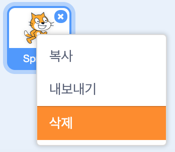

온라인 또는 오프라인으로 스크래치를 사용할 수 있습니다.

+ **온라인** - 온라인 편집기를 사용하여 새 스크래치 프로젝트를 만들려면 <a href="http://rpf.io/scratch-new" target="_blank">rpf.io/scratch-new</a>로 이동하십시오.

+ **오프라인** - 오프라인으로 작업하기를 원하고 편집기를 아직 설치하지 않은 경우 <a href="http://rpf.io/scratch-off" target="_blank">rpf.io/scratch-off</a>에서 다운로드 할 수 있습니다.

스크래치 편집기는 다음과 같은 모습입니다.

+ 당신에게 보여지는 고양이 스프라이트는 스크래치의 마스코트입니다. 만약 빈 스크래치 프로젝트가 필요하면 마우스 오른쪽 버튼을 클릭한 다음 **삭제**를 클릭하여 고양이를 삭제할 수 있습니다.

