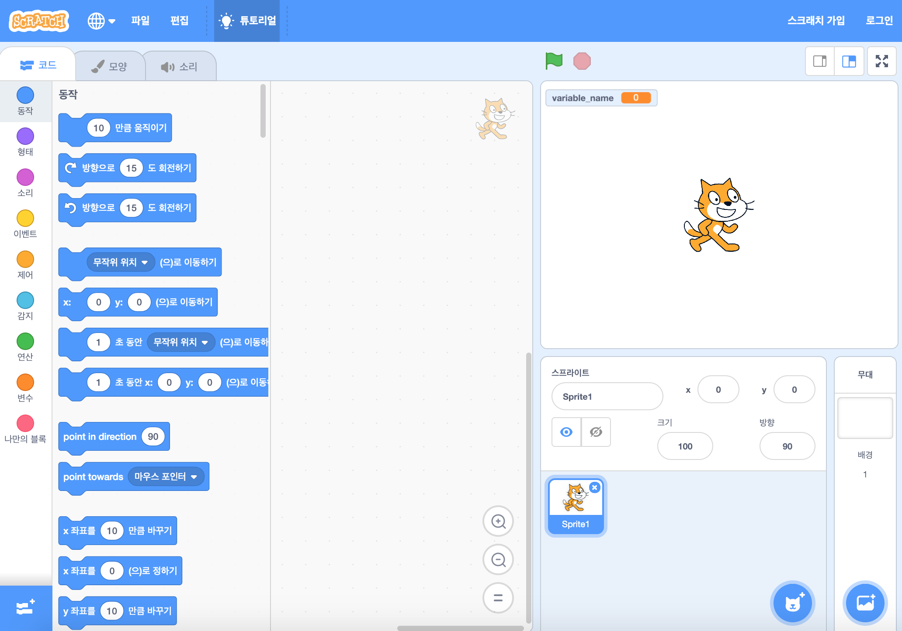

온라인 또는 오프라인으로 스크래치를 사용할 수 있습니다.

+ **Online** - to create a new Scratch project using the online editor, go to <a href="https://rpf.io/scratch-new" target="_blank">rpf.io/scratch-new</a>

+ **Offline** - if you prefer to work offline and have not installed the editor yet, you can download it from <a href="https://rpf.io/scratch-off" target="_blank">rpf.io/scratch-off</a>

스크래치 편집기는 다음과 같은 모습입니다.

+ 당신에게 보여지는 고양이 스프라이트는 스크래치의 마스코트입니다. 만약 빈 스크래치 프로젝트가 필요하면 마우스 오른쪽 버튼을 클릭한 다음 **삭제**를 클릭하여 고양이를 삭제할 수 있습니다.

