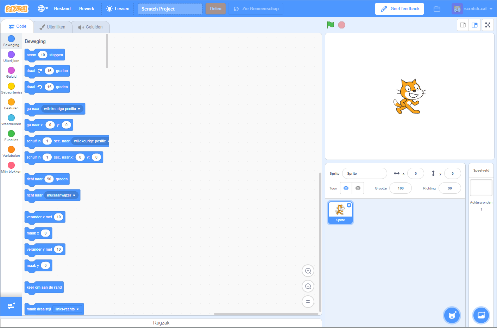
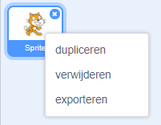

Je kunt Scratch online of offline gebruiken.

+ **Online** - om een ​​nieuw Scratch-project te maken met behulp van de online editor, ga naar <a href="http://rpf.io/scratch-new" target="_blank">rpf.io/scratch-new</a>

+ **Off line** - als je liever offline werkt en de editor niet nog hebt geïnstalleerd, kun je die downloaden vanaf <a href="http://rpf.io/scratch-off" target="_blank">rpf.io/scratch-off</a>

De Scratch-editor ziet er als volgt uit:

+ De kat sprite die je ziet is de Scratch mascotte. Als je een leeg Scratch-project nodig hebt, kun je de kat verwijderen door er met de rechtermuisknop op te klikken en vervolgens op **verwijderen** te klikken.

