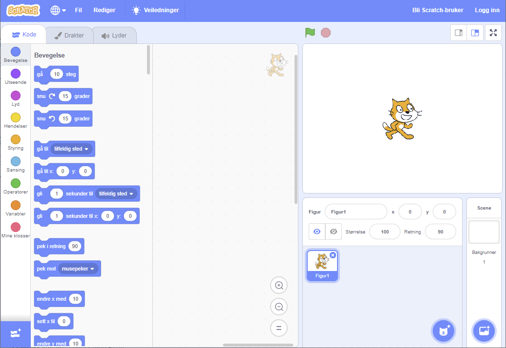
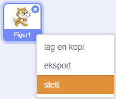

Du kan bruke Scratch online på nettet eller frakoblet.

+ **Online** - for å lage et nytt Scratch-prosjekt ved hjelp av online-editoren, gå til <a href="http://rpf.io/scratch-new" target="_blank">rpf.io/scratch-new</a>

+ **Frakoblet** - Hvis du foretrekker å jobbe frakoblet og ikke har installert programmet ennå, kan du laste det ned fra <a href="http://rpf.io/scratch-off" target="_blank">rpf.io/scratch-off</a>

Scratch-programmet ser slik ut:

+ Kattefiguren som du kan se er Scratch maskoten. Hvis du trenger et tomt Scratch-prosjekt, kan du slette katten ved å høyreklikke på den og deretter klikke **slett**.

