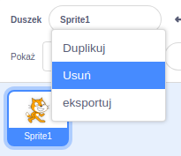

Możesz używać Scratch w wersji online lub offline.

+ **Online** - aby utworzyć nowy projekt Scratch za pomocą edytora online, przejdź do <a href="http://rpf.io/scratch-new" target="_blank">rpf.io/scratch-new</a>

+ **Offline** - jeśli wolisz pracować w trybie offline i nie zainstalowałeś jeszcze edytora, możesz pobrać go z <a href="http://rpf.io/scratch-off" target="_blank">rpf.io/scratch-off</a>

Edytor Scratch wygląda następująco:

+ Duszek kota, który można zobaczyć, to maskotka Scratch. Jeśli potrzebujesz pustego projektu Scratch, możesz usunąć kota klikając go prawym przyciskiem myszy, a następnie klikając przycisk **usuń**.

