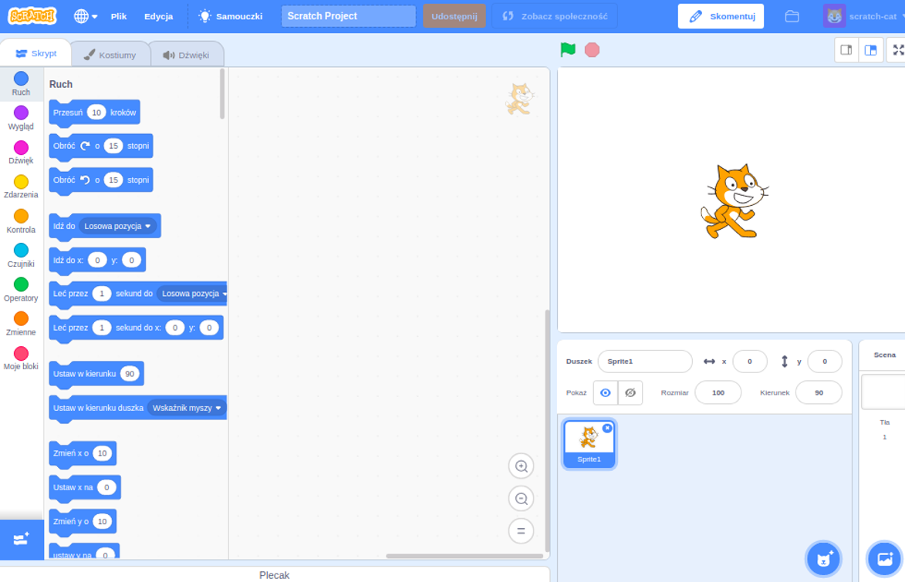

Możesz używać Scratch w wersji online lub offline.

+ **Online** - to create a new Scratch project using the online editor, go to <a href="https://rpf.io/scratch-new" target="_blank">rpf.io/scratch-new</a>

+ **Offline** - if you prefer to work offline and have not installed the editor yet, you can download it from <a href="https://rpf.io/scratch-off" target="_blank">rpf.io/scratch-off</a>

Edytor Scratch wygląda następująco:

+ Duszek kota, który można zobaczyć, to maskotka Scratch. Jeśli potrzebujesz pustego projektu Scratch, możesz usunąć kota klikając go prawym przyciskiem myszy, a następnie klikając przycisk **usuń**.

