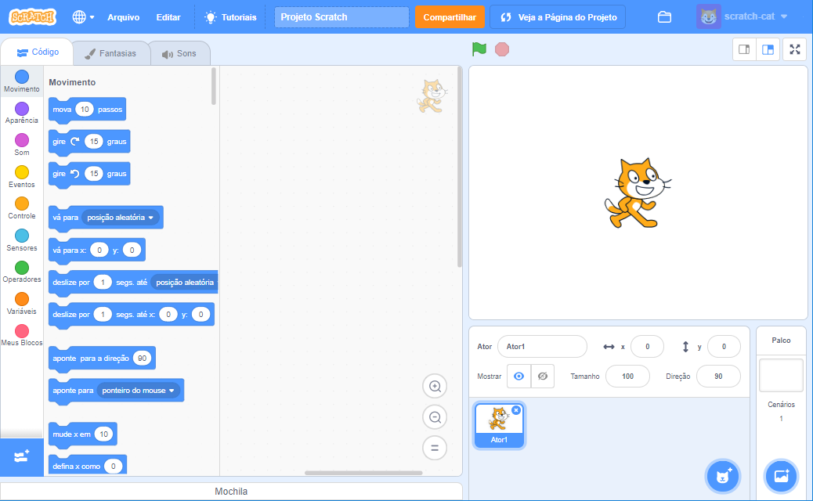
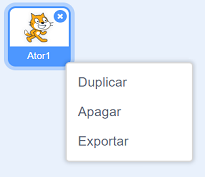

Você pode usar o Scratch online ou offline.

+ **On-line** - Para criar um novo projeto no Scratch usando o editor online, acesse <a href="https://rpf.io/scratch-new" target="_blank">rpf.io/scratch-new</a>

+ **Off-line** - Se você preferir trabalhar offline e ainda não instalou o editor, você pode baixá-lo em <a href="https://rpf.io/scratch-off" target="_blank">jumpto.cc/scratch-off</a>

O editor Scratch se parece com isso:

+ A imagem do gato que você pode ver é o mascote do Scratch. Se você precisa de um projeto vazio no Scratch, você pode deletar o gato clicando nele com o botão direito do mouse e depois clicando em **deletar**.

