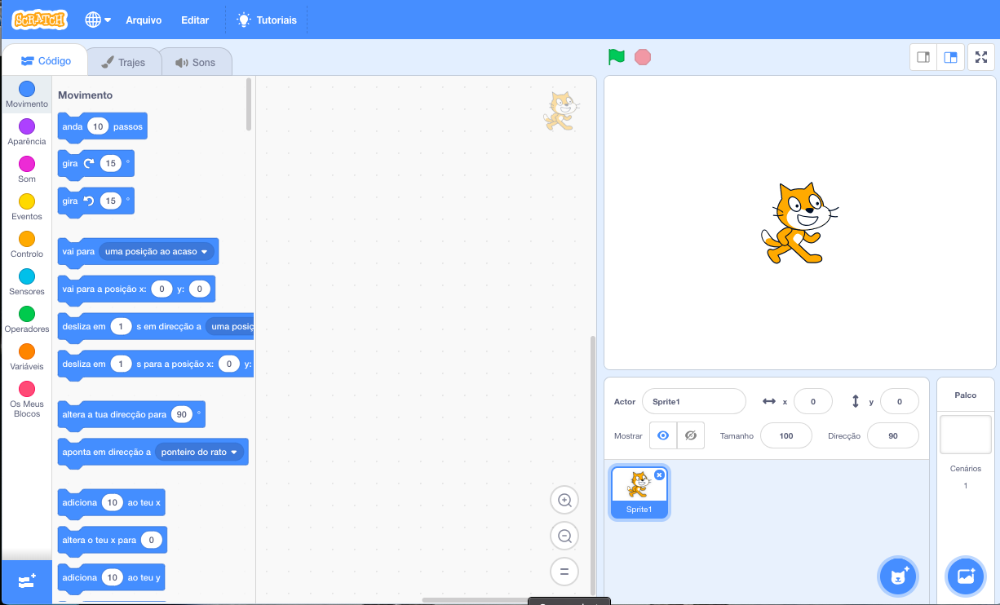
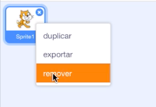

Podes usar o Scratch online ou offline.

+ **Online** - para criar um novo projeto do Scratch utilizando o editor on-line, vai para <a href="https://rpf.io/scratch-new" target="_blank">rpf.io/scratch-new</a>

+ **Offline** - se preferes trabalhar offline e ainda não instalaste o editor, podes descarregar em <a href="https://rpf.io/scratch-off" target="_blank">rpf.io/scratch-off</a>

O editor do Scratch tem este aspeto:

+ O gato que estás ver é a mascote do Scratch. Se precisares de um projeto Scratch vazio podes excluir o gato, basta clicar com o botão do lado direito do rato e depois escolher **remover**.

