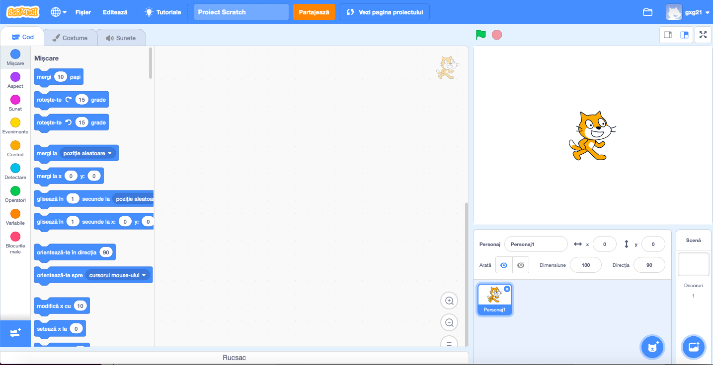
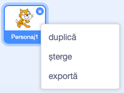

Poți utiliza Scratch online sau offline.

+ **Online** - to create a new Scratch project using the online editor, go to <a href="https://rpf.io/scratch-new" target="_blank">rpf.io/scratch-new</a>

+ **Offline** - if you prefer to work offline and have not installed the editor yet, you can download it from <a href="https://rpf.io/scratch-off" target="_blank">rpf.io/scratch-off</a>

Editorul Scratch arată astfel:

+ Personajul pisică, pe care-l puteți vedea, este chiar mascota Scratch. Dacă ai nevoie de un proiect Scratch gol, poți șterge pisica apăsând click dreapta și apoi pe **șterge**.

