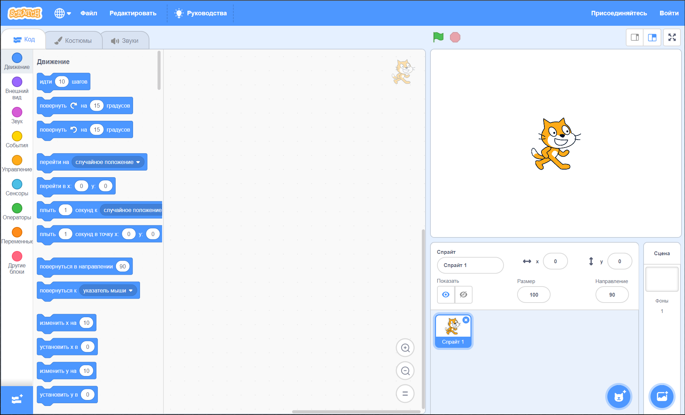
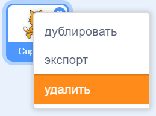

Ты можешь использовать Скретч онлайн (на сайте) и офлайн (без необходимости подключаться к Интернету).

+ **Online** - to create a new Scratch project using the online editor, go to <a href="https://rpf.io/scratch-new" target="_blank">rpf.io/scratch-new</a>

+ **Offline** - if you prefer to work offline and have not installed the editor yet, you can download it from <a href="https://rpf.io/scratch-off" target="_blank">rpf.io/scratch-off</a>

Редактор Скретч выглядит так:

+ Cпрайт кошки, который вы видите, — это талисман Скретч. Если вам нужен пустой проект Скретч, вы можете удалить кошку, щелкнув по ней правой кнопкой мыши и нажав **удалить**.

