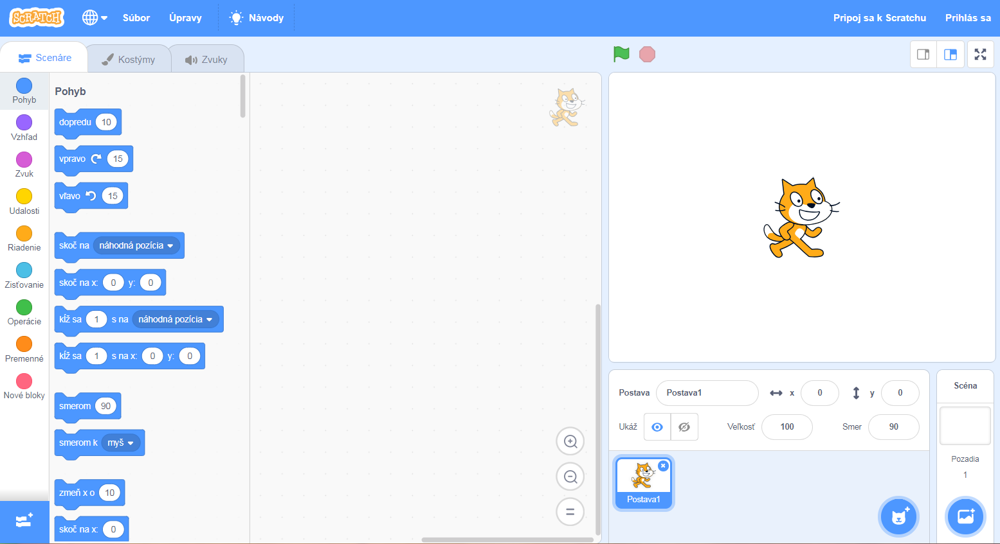
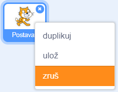

Scratch môžete používať online alebo offline.

+ **Online** - to create a new Scratch project using the online editor, go to <a href="https://rpf.io/scratch-new" target="_blank">rpf.io/scratch-new</a>

+ **Offline** - if you prefer to work offline and have not installed the editor yet, you can download it from <a href="https://rpf.io/scratch-off" target="_blank">rpf.io/scratch-off</a>

Scratch editor vyzerá takto:

+ Postava mačky, ktorú môžete vidieť, je maskot jazyka Scratch. Ak potrebujete prázdny Scratch projekt, môžete mačku odstrániť kliknutím na ňu pravým tlačidlom myši a následne kliknutím na tlačidlo **zruš**.

