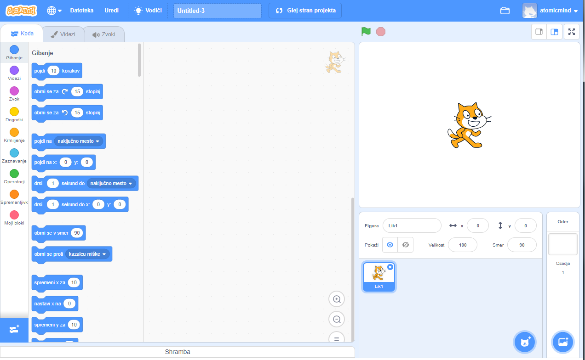
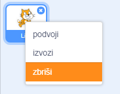

Scratch lahko uporabljaš z ali brez omrežne povezave.

+ **Online** - to create a new Scratch project using the online editor, go to <a href="https://rpf.io/scratch-new" target="_blank">rpf.io/scratch-new</a>

+ **Offline** - if you prefer to work offline and have not installed the editor yet, you can download it from <a href="https://rpf.io/scratch-off" target="_blank">rpf.io/scratch-off</a>

Scratch urejevalnik je videti takole:

+ Lik mačke, ki ga vidiš, je Scratch maskota. Če potrebuješ prazen Scratch projekt, lahko mačko izbrišeš z desnim klikom miške na mačko in klikom na **izbriši**.

