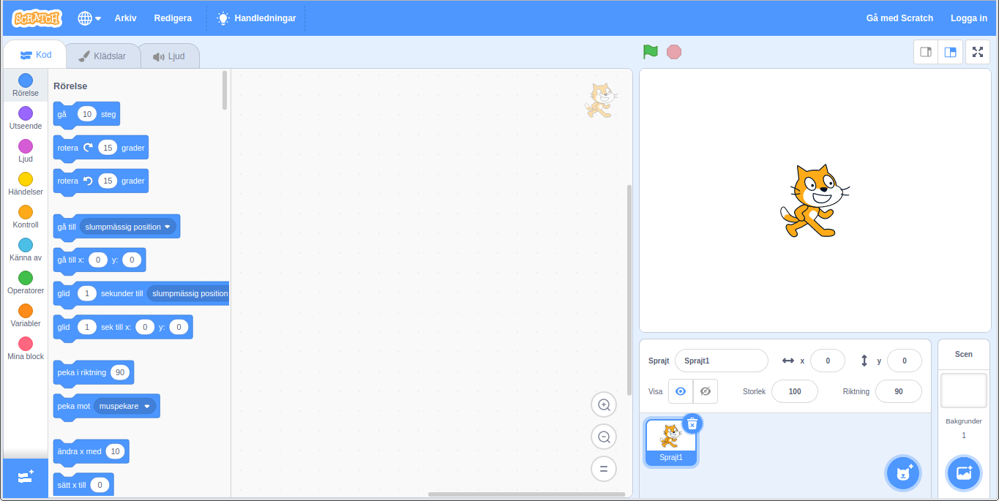
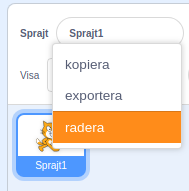

Du kan använda Scratch online eller offline.

+ **Online** - to create a new Scratch project using the online editor, go to <a href="https://rpf.io/scratch-new" target="_blank">rpf.io/scratch-new</a>

+ **Offline** - if you prefer to work offline and have not installed the editor yet, you can download it from <a href="https://rpf.io/scratch-off" target="_blank">rpf.io/scratch-off</a>

Scratch-redigeraren ser ut så här:

+ Katt-sprajten som du kan se är Scratch mascot. Om du behöver ett tomt Scratch-projekt kan du ta bort katten genom att högerklicka på den och sedan klicka på **radera**.

