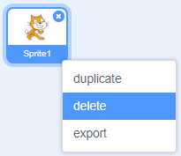

நீங்கள் Scratch-ஐ ஆன்லைன் அல்லது ஆஃப்லைனில் பயன்படுத்தலாம்.

+ **Online** - to create a new Scratch project using the online editor, go to <a href="https://rpf.io/scratch-new" target="_blank">rpf.io/scratch-new</a>

+ **Offline** - if you prefer to work offline and have not installed the editor yet, you can download it from <a href="https://rpf.io/scratch-off" target="_blank">rpf.io/scratch-off</a>

Scratch பதிப்பான் பின்வருமாறு இருக்கும்:

+ இங்கு நீங்கள் பார்க்கும் இந்த பூனை sprite (ஸ்ப்ரைட்) தான் Scratch mascot (மாஸ்காட் - நற்பேறுக்கான ஒரு சின்னம்) ஆகும். உங்களுக்கு ஒரு வெற்று Scratch திட்டம் தேவைப்பட்டால், இந்த பூனையை வலது-கிளிக் செய்து, பின்னர், **delete** (நீக்கு) என்பதைக் கிளிக்(click - சொடுக்கவும்) செய்வதன் மூலம் நீக்கலாம்.

