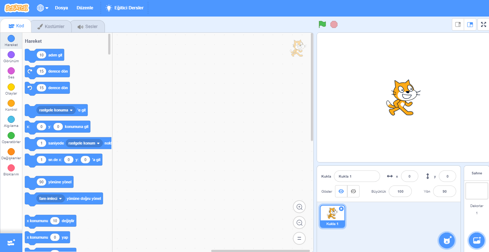
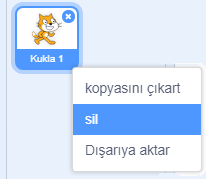

Scratch'ı çevrimiçi veya çevrimdışı olarak kullanabilirsiniz.

+ **Çevrimiçi** - Çevrimiçi Düzenleyici'yi kullanarak yeni bir Scratch projesi oluşturmak için, <a href="http://rpf.io/scratch-new" target="_blank">rpf.io/scratch-new</a> adresine gidin

+ **Çevrimdışı** - Çevrimdışı çalışmayı tercih edip, henüz Düzenleyiciyi kurmadıysanız, <a href="http://rpf.io/scratch-off" target="_blank">rpf.io/scratch-off</a> adresinden indirebilirsiniz

Scratch editörü şu şekilde görünür:

+ Gördüğünüz kedi karakteri, Scratch'in maskotudur. Boş bir Scratch projesine ihtiyaç duyarsanız, Kedi karakterine sağ tuşla tıklayıp, ardından **Sil** seçeneğine basabilirsiniz.

