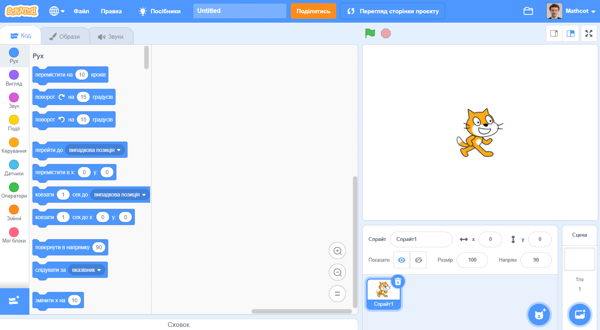
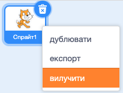

Ти можеш використовувати Скретч онлайн або офлайн.

+ **Online** - to create a new Scratch project using the online editor, go to <a href="https://rpf.io/scratch-new" target="_blank">rpf.io/scratch-new</a>

+ **Offline** - if you prefer to work offline and have not installed the editor yet, you can download it from <a href="https://rpf.io/scratch-off" target="_blank">rpf.io/scratch-off</a>

Редактор Скретч виглядає так:

+ Спрайт кота, який ти бачиш, — це символ Скретч. Якщо тобі потрібен порожній проєкт, ти можеш видалити кота, клацнувши на ньому правою кнопкою миші і вибравши пункт **вилучити**.

