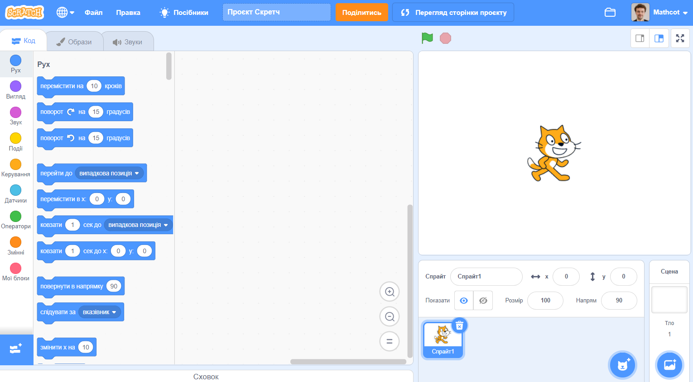

Ти можеш використовувати Скретч онлайн або офлайн.

+ **Онлайн**: щоб створити новий проєкт у Скретч за допомогою онлайн-редактора, перейди на <a href="http://rpf.io/scratch-new" target="_blank">rpf.io/scratch-new</a>

+ **Офлайн**: якщо ти хочеш працювати в режимі офлайн і ще не встановив (-ла) редактор, ти можеш завантажити його з <a href="http://rpf.io/scratch-off" target="_blank">rpf.io/scratch-off</a>

Редактор Скретч виглядає так:

+ The cat sprite that you can see is the Scratch mascot. If you need an empty Scratch project, you can delete the cat by right-clicking it and then clicking **delete**.

