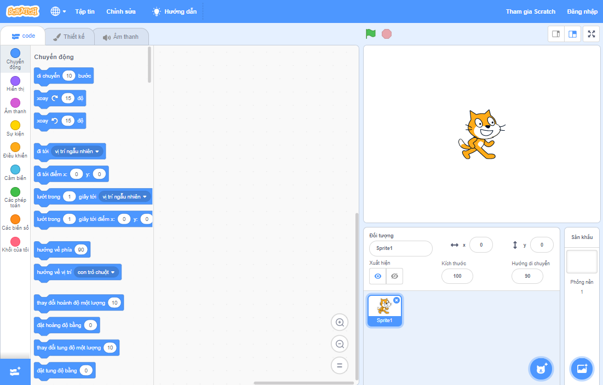
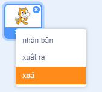

Bạn có thể sử dụng Scratch trực tuyến hoặc ngoại tuyến.

+ **Online** - to create a new Scratch project using the online editor, go to <a href="https://rpf.io/scratch-new" target="_blank">rpf.io/scratch-new</a>

+ **Offline** - if you prefer to work offline and have not installed the editor yet, you can download it from <a href="https://rpf.io/scratch-off" target="_blank">rpf.io/scratch-off</a>

Trình soạn thảo Scratch trông giống như sau:

+ Hình ảnh con mèo mà bạn có thể thấy là linh vật Scratch. Nếu bạn cần một dự án Scratch trống, bạn có thể xóa con mèo bằng cách nhấp chuột phải vào nó và sau đó nhấp vào **xóa**.

