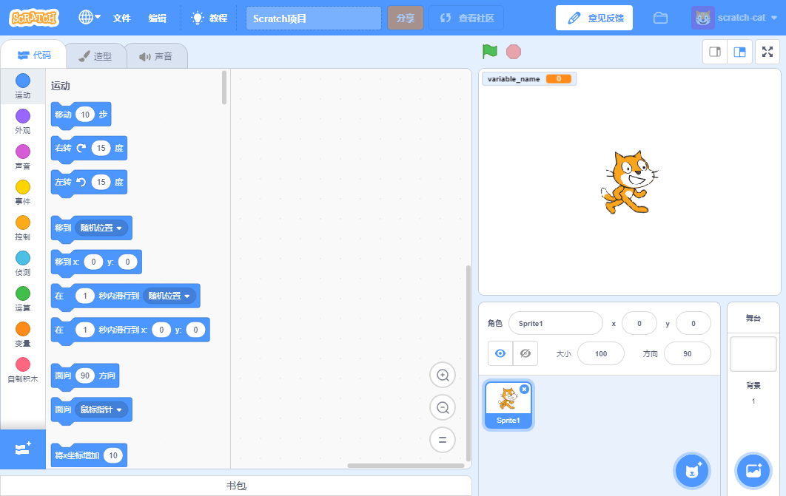
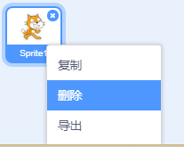

你可以在线使用Scratch或者离线使用。

+ **在线** - 要使用在线编辑器创建一个新的Scratch项目，点击<a href="https://rpf.io/scratch-new" target="_blank">rpf.io/scratch-new</a>

+ **离线** - 如果您想离线工作但尚未安装编辑器，可以从<a href="https://rpf.io/scratch-off" target="_blank"> rpf.io/scratch-off</a>下载

Scratch编辑器看上去就像这样：

+ 你看到的猫的角色是Scratch的吉祥物。 如果你需要一个空白的Scratch项目，你可以右键点击猫然后单击**删除**来删除它。

