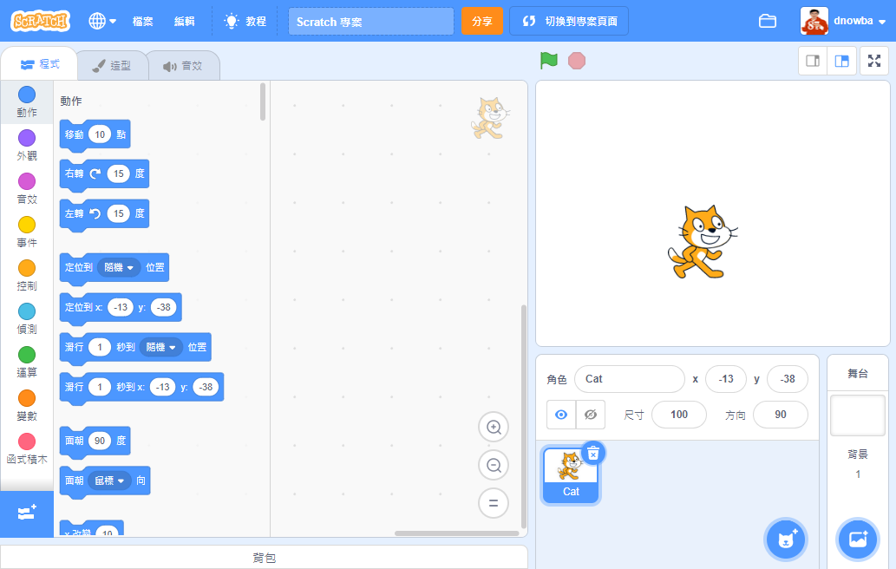
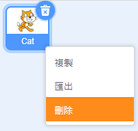

你可以選擇在線或離線使用 Scratch。

+ **在線** - 要使用線上編輯器新建 Scratch 專案，可從 <a href="http://rpf.io/scratch-new" target="_blank">rpf.io/scratch-new</a> 開始

+ **離線** - 要離線工作，但還沒有安裝編輯器，可至 <a href="http://rpf.io/scratch-off" target="_blank">rpf.io/scratch-off</a> 下載

Scratch 編輯器看起來像這樣：

+ 畫面中的貓咪角色是 Scratch 的吉祥物。 如果你要空白的 Scratch 專案，可以在牠身上點擊滑鼠右鍵並選擇**刪除**牠。或者你也可以點擊角色圖示上的回收桶圖示。

